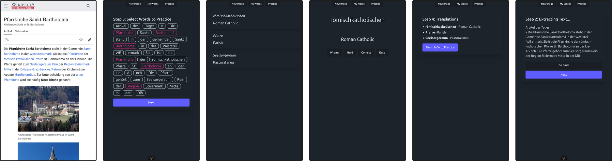

*Archived prototype to upload a screenshot of German text, run it through OCR, extract interesting words, auto-translate, and learn as flashcards* 

## Tech Stack

- Vue3
- Typescript
- (using Vite)
- Tailwind.CSS and DaisyUI installed for looks

## Running It

1. make sure you have `npm` installed
2. install dependencies with `npm i`
3. run `npm run dev` and open the link in a browser

- make sure to create a `.env` file with a valid openAI key called `OPENAI_API_KEY`, otherwise the app will fail at scanning.
